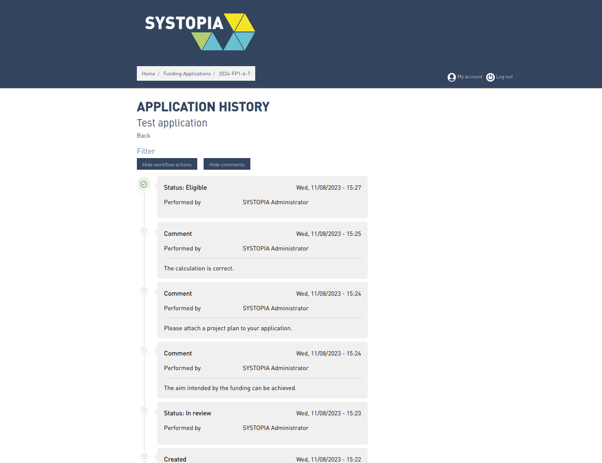

# Usage for applicants

This section describes the typical usage of the funding portal for persons who apply to the funding program. This includes the application process as well as the workflow after a funding has been granted.

## Login

To create a new application, applicants need to be provided with a username and password to log into the funding portal.  Their user account needs to have the correct permissions, see the section [User Permissions](../user-permissions.md) for more details.

After login in, applicants can change their password at **My account** → **Edit**. All other possible actions can be found on the dashboard page.

## Create a new application

Applicants can create a new application by opening the dashboard and choosing **New Application**. The first step is to choose the funding program they want to apply for. This leads to the application form which can be long and divided into multiple tabs.

It is possible to save a draft and continue to work on the application at another time. When it is finished, it can be submitted by clicking on the button **Apply**.

###  Combined applications

...

## Change an application

The dashboard elements **My Applications** and **My Combined Applications** show the existing applications and their current states. The applications can be opened which leads to the same form as before, containing the details of the application. The available actions however depend on the status that the application currently has.

Before applying, there are two actions possible that are reflected in the buttons available at the bottom of the form: **Save** the application after editing, or **Apply** to submit the application. If the application is in the status _review_, there will be one other button shown, namely **Request Change**.

All possible states and the available actions are explained [here]().

## View the history of an application

The applications listed in **My Applications** or **My Combined Applications** also allow for the action **Application History**. This leads to a flow chart showing every status that the application has gone through in chronological order, including public comments created by the reviewers or applicants.

It is possible to hide all comments or to hide all workflow actions.

## Transfer contracts

Available actions are:

* download the transfer contract
* create a drawdown
* show existing drawdowns

