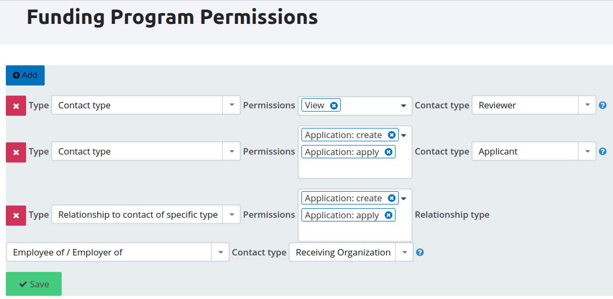
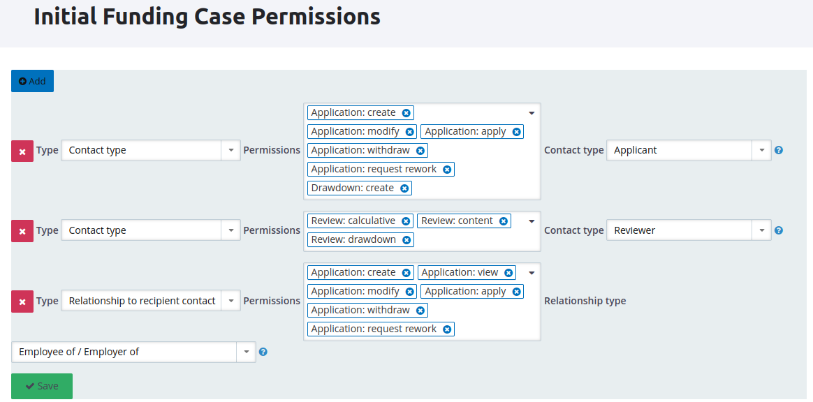

# Users and permissions

In a funding program and for a specific funding case, different people from the giving organisation might be involved. If the receiving contact is an organisation, there might be different people interacting with the funding case as well. These people have different roles that come with different permissions regarding the funding case, for example creating an application or rejecting it.

### Permissions for the giving organisation

The giving organisation is the organisation that operates CiviCRM. Therefore, it should be configured as the default organisation of CiviCRM, namely the organisation specified at `civicrm/admin/domain` with contact id `1`.

Within each funding program, you can configure roles that have different permission sets. You can assign permissions to specific contacts, contact types or contacts that have a relationship to a specific contact or contact type. In the last case, you need to specify the relationship type.

The following permissions exist:

- Application: view
- Application: request rework
- Review: content
- Review: calculative
- Review: drawdown

A typical example would be a separation in three roles:

- The **content reviewer** checks the content of an application. They have the permission "Application: view", "Application: request rework" and "Review: content".
- The **calculative reviewer** checks the financial calculations of an application. They have the permission "Application: view", "Application: request rework" and "Review: calculative".
- The **drawdown reviewer** checks if the funding of an accepted application have been called up. They have the permission "Application: view" and "Review: drawdown".

If your funding program is big and allows for applications in different thematic areas, you might want to assign one of your employees to be the content reviewer for topic A and another employee to be the content reviewer for topic B. To allow for this or other specific needs, the permissions are set on a case by case basis and not for the whole funding program. You will need to configure an initial permission set that is applied automatically for each new application. Additionally, it is possible to change the permissions for specific funding applications.

!!! question
    Is this example realistic?

### Permissions for the receiving contact

The contact that applies for a funding and maybe receives money has different permissions. There exist multiple separate permissions, because the receiving contact might be an organisation and different people within that organisation might be entrusted with different tasks.

The following permissions exist and can be assigned to specific contacts / groups of contacts / contacts with specific relationships:

- Application: create
- Application: view
- Application: modify
- Application: apply
- Application: withdraw
- Drawdown: create

### Configure permissions

The permissions need to be configured on different levels. There are permissions that are set for the whole funding program and permissions that can be configured for every funding case individually. Additionally, there are CiviRemote user roles which have to be assigned to every user.

#### Funding program

Open the funding program overview at **Funding** → **Funding Programs** and choose the Action **Edit permissions** for your funding program.

Add permissions for CiviCRM users or user groups.

- Contacts with the permission **Application: create** will be able to create a new application for this funding program
- Contacts with the permission **Application: apply** will be able to send the finalized application to the giving organization
- Contacts with the permission **View** can view all applications of this funding program.

The permissions **Application: create** and **Application: apply** both implicitly include the permission **View**.

A configuration could look like this:

!!! question
    Are the screenshots a good example?

#### Funding case

Open the funding program overview at **Funding** → **Funding Programs** and choose the Action **Edit initial Funding Case Permissions** for your funding program.

A configuration could look like this:

To alter the permissions of a specific funding case, open the funding case list at `/civicrm/funding/case/list`, select the case and choose the action **edit permissions**.

#### CiviRemote roles

Every person you want to give any of the permissions listed above needs to have a drupal user account. This refers to reviewers of the giving organisation as well as individuals or members of external organisations that want to apply for the funding. You manually need to add CiviRemote roles to these user accounts.

Every drupal user is mapped to a CiviCRM contact. To assign a CiviRemote role, open the summary of the CiviCRM contact and edit the field set **RemoteContact Information**.

- for reviewers add the role **CiviRemote User**.
- for receiving contacts add the roles **CiviRemote User** and **CiviRemote Funding**.

!!! note
    The roles are automatically synchronised with the Drupal user account during login. If there are problems with the synchronisation, open the drupal user overview at `admin/people`. Select the user that you want to assign the roles to and perform the action **CiviRemote: Match contact(s)** and afterward **CiviRemote: Synchronise CiviRemote roles**.

#### Drupal Roles

Grant the permission **Access CiviCRM Funding** to the already existing role **authenticated user**.

